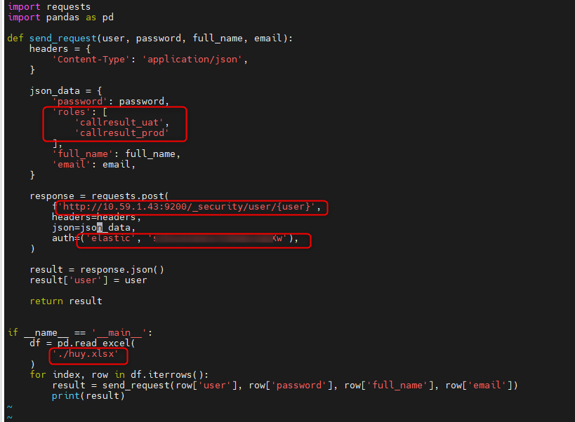
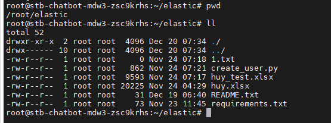

<h1 style="color:orange">Script add nhiều user cho elasticsearch</h1>
Script sử dụng python để add nhiều user vào elasticsearch qua API, sử dụng thông tin lấy từ file xlsx.<br>
Yêu cầu cài đặt python3.8.<br>
Cài đặt các requirements qua file requirements.txt

    # pip3 install -r requirements.txt
Nội dung file requirements.txt
```
openpyxl==3.0.10
pandas==1.0.5
xlrd==1.2.0
XlsxWriter==1.3.6
xlwt==1.3.0
```
<h2 style="color:orange">Script add user</h2>
Tạo file create_user.py:

```
import requests
import pandas as pd

def send_request(user, password, full_name, email):
    headers = {
        'Content-Type': 'application/json',
    }

    json_data = {
        'password': password,
        'roles': [
            'callresult_uat',
            'callresult_prod'
        ],
        'full_name': full_name,
        'email': email,
    }

    response = requests.post(
        f'http://10.59.1.43:9200/_security/user/{user}',
        headers=headers,
        json=json_data,
        auth=('elastic', 'elastic_password'),
    )

    result = response.json()
    result['user'] = user

    return result

if __name__ == '__main__':
    df = pd.read_excel(
        './huy.xlsx'
    )
    for index, row in df.iterrows():
        result = send_request(row['user'], row['password'], row['full_name'], row['email'])
        print(result)
```

<br>
Trong đó:
- `roles`: là các roles được tạo sẵn muốn gán cho user
- API để gọi vào elastic
- `auth`: là user, password kết nối tới elastic
- `./huy.xlsx`: là file xlsx để truyền vào

Nội dung file xlsx:<br>
<br>
Lưu ý, các trường và thứ tự phải giống hệt như hình
<h2 style="color:orange">2. Chạy script</h2>

    # python3 create_user.py > 1.txt
để stdout của script gen vào file 1.txt

Folder để chạy script sẽ trông ntn:<br>
<br>

<h2 style="color:orange">Script update role for user</h2>
Tạo file update_role.py:

``` 
import requests
import pandas as pd

def send_request(user, full_name, email):
    headers = {
        'Content-Type': 'application/json',
    }

    json_data = {
        'roles': [
            'callresult_prod'
        ],
        'full_name': full_name,
        'email': email,
    }

    response = requests.post(
        f'http://10.59.1.42:9200/_security/user/{user}',
        headers=headers,
        json=json_data,
        auth=('elastic', 'elastic_password),
    )

    result = response.json()
    result['user'] = user

    return result
if __name__ == '__main__':
    df = pd.read_excel(
        './huy_test.xlsx'
    )
    for index, row in df.iterrows():
        result = send_request(row['user'], row['full_name'], row['email'])
        print(result)
```
Nội dung file xlsx:<br>
<br>
