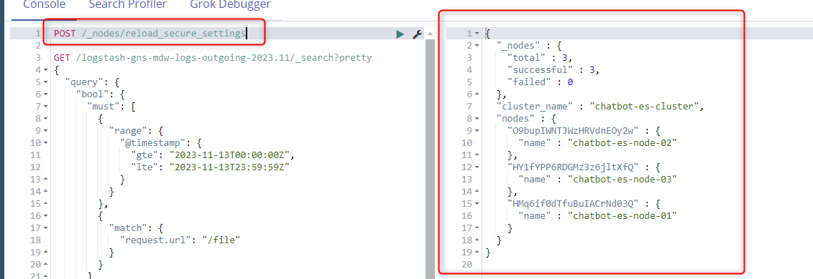

<h1 style="color:orange">Tạo snapshot repository cho elasticsearch</h1>
Mặc định snapshot repository ko được enable với elasticsearch. Để enable lên, ssh vào từng node chạy lệnh:

    # cd /usr/share/elasticsearch/bin/elasticsearch-plugin install repository-s3
    # systemctl restart elasticsearch
Thêm repo lưu snapshot cho elasticsearch:

    # vim /etc/elasticsearch/elasticsearch.yml
    thêm dòng
    s3.client.sgn10.endpoint: s3-sgn10.fptcloud.com

    # systemctl restart elasticsearch
Ví dụ ở đây domain của nơi lưu snapshot là `s3-sgn10.fptcloud.com`<br>
Lưu ý: syntax sau `client` là `sgn10`.

Add key access repository snapshot:

    # cd /usr/share/elasticsearch/bin/elasticsearch-keystore add s3.client.sgn10.access_key
    # cd /usr/share/elasticsearch/bin/elasticsearch-keystore add s3.client.sgn10.secret_key
Lưu ý: syntax sau client là `sgn10` trùng với config trong file elasticsearch.yml

Sau khi add key, ko cần phải restart elasticsearch để nhận key, chỉ cần curl API đến elasticsearch trên devtools:

    # POST /_nodes/reload_secure_settings
<br>

Chạy API để kết nối đến repo:<br>
```
PUT /_snapshot/bl-repo
{
  "type": "s3",
  "settings": {
    "bucket": "fci-chatbot-prod",
    "base_path" : "ES_BACKUP/BL35",
    "path_style_access": "true",
    "compress": "true",
    "client": "sgn10"
  }
}
```
Trong đó:<br>
- bucket: fci-chatbot-prod
- base_path: là path trên bucket để lưu snapshot
- client: sgn10, trùng với tên client đã config ở trên
Chạy lệnh có kết quả `acknowledged: true` là thành công.

<br>
<h2 style="color:orange">1. Tạo snapshot và đẩy lên snapshot repository</h2>
Sử dụng elasticsearch-curator: https://github.com/elastic/curator

Config mẫu của elasticsearch-curator:
```
actions:
  1:
    action: snapshot
    description: >-
      Snapshot 'logstash-bl35-tracing-' prefixed indice of the present day with the default snapshot name pattern of
      'bl35-tracing-%Y%m%d' to 'bl-repo' repository.  Wait for the snapshot to complete.  Do not skip
      the repository filesystem access check.
    options:
      repository: bl-repo
      name: bl35-tracing-%Y%m%d
      wait_for_completion: True
      max_wait: 3600
      wait_interval: 10
      ignore_unavailable: False
      include_global_state: False
      partial: False
      skip_repo_fs_check: False
      timeout_override:
      continue_if_exception: False
      disable_action: False
    filters:
    - filtertype: pattern
      kind: prefix
      value: logstash-bl35-tracing-
      exclude:
    - filtertype: period
      source: name
      range_from: 0
      range_to: 0
      timestring: '%Y.%m.%d'
      unit: days
  2:
    action: delete_indices
    description: >-
      Delete indices older than 30 days (based on index name), for 'logstash-bl35-tracing-' prefixed indices.  Ignore the
      error if the filter does not result in an actionable list of indices (ignore_empty_list) and exit cleanly.
    options:
      ignore_empty_list: True
      timeout_override:
      continue_if_exception: True
      disable_action: False
    filters:
    - filtertype: pattern
      kind: prefix
      value: logstash-bl35-tracing-
      exclude:
    - filtertype: age
      source: name
      direction: older
      timestring: '%Y.%m.%d'
      unit: days
      unit_count: 20
      exclude:
  3:
    action: delete_snapshots
    description: "Delete selected snapshots (older than 90 days) from 'bl-repo' repository"
    options:
      repository: bl-repo
      ignore_empty_list: True
      timeout_override:
      continue_if_exception: True
      disable_action: False
      retry_interval: 120
      retry_count: 3
    filters:
    - filtertype: pattern
      kind: prefix
      value: bl35-tracing-
      exclude:
    - filtertype: age
      source: name
      direction: older
      timestring: '%Y%m%d'
      unit: days
      unit_count: 60
      exclude:
```
<h2 style="color:orange">2. Check snapshot trên repository</h2>
Trên devtool:

    # GET /_snapshot/fec-repo/_all
Với `fec-repo` là tên repo

<br>
Để restore index từ repo, curl API trên devtool:<br>
<br>
Với `sgn10` là tên repository, `callcenter-2020` là tên bản snapshot.