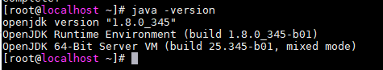
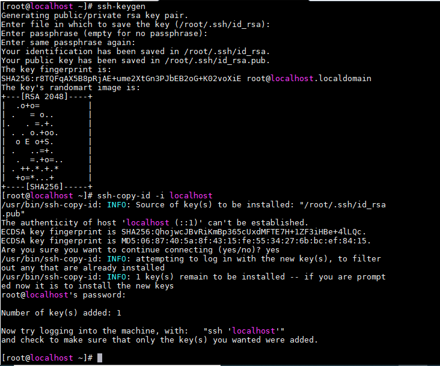
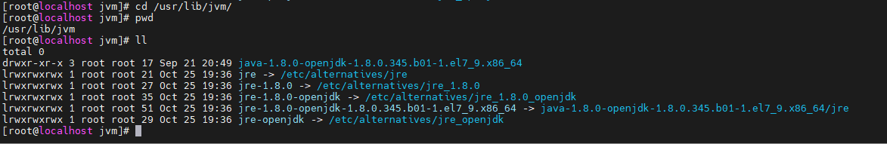
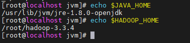
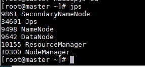
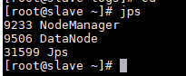

<h1 style="color:orange">Hadoop install 1 node</h1>
Cài đặt trên 2 node: 
192.168.1.70 - master 
192.168.1.78 - slave 
<h2 style="color:orange">1. Prerequesites</h2>
Cài đặt java trên tất cả các node

    # yum install -y java
 
<h3 style="color:orange">1.1. Cấu hình Password-less SSH</h3>
Hadoop sẽ quản lý các nodes bằng SSH. Node master dùng SSH để kết nối tới các slave node để chạy tác vụ start và stop. 
Chúng ta cần phải setup password-less ssh để master có thể liên lạc với slave sử dụng ssh mà ko cần password.

Với cấu hình chạy 1 node, Master (Namenode, Secondary Namenode và Resource Manager) và Slave (Datanode và Nodemanager) sẽ chạy trên JVM độc lập. Mặc dù cài trên 1 node, chúng ta vẫn cần cài password-less ssh để cho Master có thể liên lạc với Slave mà không cần authen.

Chú ý: Các bước sau thực hiện trên cả 2 server, mục đích 2 server(master, slave) ssh đến nhau ko cần password 
1. Tạo public và private SSH trên server 

       # ssh-keygen -t rsa
2. Copy SSH public-key (id_rsa.pub) đến root account ở cả 2 server (lưu ý đây là ssh account root, nếu sử dụng account khác để chạy hadoop thì phải switch sang account đó và chạy lệnh keygen)

        # ssh-copy-id 192.168.1.70
        # ssh-copy-id 192.168.1.78
4. Dựa trên phiên bản SSH, cần phải set quyền thư mục .ssh (700) và file authorized_keys (600) trên cả master và slave hadoop

        # chmod 700 ~/.ssh
        # chmod 600 ~/.ssh/authorized_keys
 
Sau khi cài thử ssh ngược đến localhost 
Nếu không yêu cầu password là thành công.
<h2 style="color:orange">2. Cài hadoop (cả 2 server)</h2>

    # wget https://dlcdn.apache.org/hadoop/common/stable/hadoop-3.3.4.tar.gz --no-check-certificate
    # tar xzvf hadoop-3.3.4-src.tar.gz
<h3 style="color:orange">2.1. Tạo biến môi trường cho hadoop trên cả 2 server</h3>
   
    # vim /etc/profile.d/hadoop_java.sh
paste vào
   
    export JAVA_HOME=/usr/lib/jvm/jre-1.8.0-openjdk
    export PATH=$PATH:$JAVA_HOME/bin
    export HADOOP_HOME=/root/hadoop-3.3.4
    export HADOOP_INSTALL=$HADOOP_HOME
    export HADOOP_HDFS_HOME=$HADOOP_HOME
    export HADOOP_MAPRED_HOME=$HADOOP_HOME
    export YARN_HOME=$HADOOP_HOME
    export HADOOP_COMMON_HOME=$HADOOP_HOME
    export HADOOP_COMMON_LIB_NATIVE_DIR=$HADOOP_HOME/lib/native
    export PATH=$PATH:$HADOOP_HOME/sbin:$HADOOP_HOME/bin
với `JAVA_HOME=/usr/lib/jvm/jre-1.8.0-openjdk` là đường dẫn tới nơi cài đặt java của host 
 
`HADOOP_HOME=/root/hadoop-3.3.4` là đường dẫn tới nơi cài đặt hadoop
sau đó chạy lệnh để environment ăn cấu hình vừa thêm

    # bash
việc thêm biến môi trường vào directory /etc/profile.d/ để sau khi OS reset, nó vẫn đọc cấu hình môi trường từ file này.

Chạy lệnh để kiểm tra cấu hình đã ăn chưa: 
 

<h3 style="color:orange">2.2. Tạo biến môi trường hadoop trên cả 2 server</h3>

    # vim $HADOOP_HOME/etc/hadoop/hadoop-env.sh
paste vào config trên node master:

    export JAVA_HOME=/usr/lib/jvm/jre-1.8.0-openjdk
    export HADOOP_HOME=/root/hadoop-3.3.4
    export HDFS_NAMENODE_USER=root
    export HDFS_DATANODE_USER=root
    export HDFS_SECONDARYNAMENODE_USER=root
    export YARN_RESOURCEMANAGER_USER=root
    export YARN_NODEMANAGER_USER=root
nếu là node slave chỉ cần paste

    export JAVA_HOME=/usr/lib/jvm/jre-1.8.0-openjdk
    export YARN_RESOURCEMANAGER_USER=root
    export YARN_NODEMANAGER_USER=root
Nếu dùng user gì để start hadoop thì điền user đó, 1 số TH sẽ dùng user hadoop 
config môi trường file mapred và yarn

    # vim $HADOOP_HOME/etc/hadoop/mapred-env.sh
    # vim $HADOOP_HOME/etc/hadoop/yarn-env.sh  
    paste vào
    export JAVA_HOME=/usr/lib/jvm/jre-1.8.0-openjdk
<h2 style="color:orange">3. Config hadoop</h2>
<h3 style="color:orange">3.1. Trên master</h3>

    # cd $HADOOP_HOME
Config core-site.xml file. File này chứa thông tin port number dùng bởi hadoop instance, file system allocated memory, data store memory limit và size of Read/Write buffers.

    # vim $HADOOP_HOME/etc/hadoop/core-site.xml
paste vào giữa `<configuration>` và `</configuration>`

    <configuration>
    <property>
    <name>fs.default.name</name>
    <value>hdfs://192.168.1.70:9000</value>
    </property>
    </configuration>

Edit file hdfs-site.xml. File này chứa thông tin giá trị replication data, namenode path và datanode path cho local file systems

    # vim $HADOOP_HOME/etc/hadoop/hdfs-site.xml
paste vào

    <configuration>
      <property>
        <name>dfs.replication</name>
        <value>2</value>
      </property>
      <property>
        <name>dfs.namenode.name.dir</name>
        <value>/root/name</value>
      </property>
    </configuration>
Lưu ý, không cần tạo file này, sau khi format namenode hadoop, file này sẽ được hadoop tạo. Vì có 2 máy nên để replication là 2.

Edit file mapred-site.xml để định nghĩa sẽ sử dụng yarn MapReduce framework

    # vim $HADOOP_HOME/etc/hadoop/mapred-site.xml
paste vào 

    <configuration>
      <property>
        <name>mapreduce.framework.name</name>
        <value>yarn</value>
      </property>
    </configuration>

Edit yarn-site.xml

    # vim $HADOOP_HOME/etc/hadoop/yarn-site.xml
paste vào

    <configuration>
    <property>
    <name>yarn.nodemanager.aux-services</name> <value>mapreduce_shuffle</value>
    </property>
    <property>
    <name>yarn.nodemanager.aux-services.mapreduce.shuffle.class</name> 
    <value>org.apache.hadoop.mapred.ShuffleHandler</value>
    </property>
    <property>
    <description>The hostname of the RM.</description>
    <name>yarn.resourcemanager.hostname</name>
    <value>192.168.1.70</value>
    </property>
    <property>
    <description>The address of the applications manager interface in the RM.</description>
    <name>yarn.resourcemanager.address</name>
    <value>192.168.1.70:8032</value>
    </property>
    </configuration>
Edit file workers để cho master biết danh sách các node slave

    # vim $HADOOP_HOME/etc/hadoop/workers
paste vào ip các node slave (lưu ý chỉ có node master mới phải sửa nội dung file này)
    
    192.168.1.78
<h3 style="color:orange">3.2. Trên slave</h3>
Nội dung các file trên tương tự node master trừ file hdfs.xml và file workers

    # vim $HADOOP_HOME/etc/hadoop/hdfs-site.xml
paste vào

    <configuration>
      <property>
        <name>dfs.replication</name>
        <value>2</value>
      </property>
      <property>
      <name>dfs.datanode.data.dir</name>
      <value>/root/data</value>
      </property>
    </configuration>
Lưu ý, không cần tạo file /root/data này, sau khi format namenode hadoop, file này sẽ được hadoop tạo
<h3 style="color:orange">3.3. Format hadoop namenode trên master</h3>
Lưu ý bước này chỉ nên thực hiện 1 lần trước khi start hadoop lần đầu tiên

    # $HADOOP_HOME/bin/hdfs namenode -format
 
<h2 style="color:orange">4. Chạy hadoop (master)</h2>

    # $HADOOP_HOME/sbin/start-all.sh
để dừng hadoop

    # $HADOOP_HOME/sbin/stop-all.sh
Sau khi chạy hadoop trên node master thì các node slave cũng tự động start các tiến trình hadoop
<h2 style="color:orange">5. Kiểm tra</h2>

Truy cập địa chỉ hadoop bằng browser http://localhost:9870

 
Kiểm tra port đang listen trên hadoop

    # netstat -tulpn
 

Port mà hadoop sử dụng: https://kontext.tech/article/265/default-ports-used-by-hadoop-services-hdfs-mapreduce-yarn

Trên node master gõ lệnh

    # yum install -y java-devel
    để lấy lệnh jps
    # jps
 
Node master sẽ chạy Namenode, SecondaryNameNode, Resource Manager. Các dịch vụ còn lại là do server Master chạy luôn dịch vụ của datanode. 

Trên node slave gõ lệnh

    # yum install -y java-devel
    để lấy lệnh jps
    # jps
 