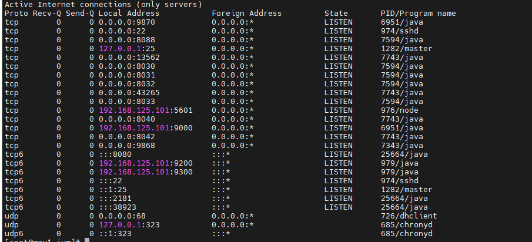

<h1 style="color:orange">Hadoop install 1 node</h1>
<h2 style="color:orange">1. Prerequesites</h2>
Cài đặt java

    # yum install -y java
 
<h3 style="color:orange">1.1. Cấu hình Password-less SSH</h3>
Hadoop sẽ quản lý các nodes bằng SSH. Node master dùng SSH để kết nối tới các slave node để chạy tác vụ start và stop. 
Chúng ta cần phải setup password-less ssh để master có thể liên lạc với slave sử dụng ssh mà ko cần password.

Với cấu hình chạy 1 node, Master (Namenode, Secondary Namenode và Resource Manager) và Slave (Datanode và Nodemanager) sẽ chạy trên JVM độc lập. Mặc dù cài trên 1 node, chúng ta vẫn cần cài password-less ssh để cho Master có thể liên lạc với Slave mà không cần authen.

1. Tạo public và private SSH trên server 

       # ssh-keygen
2. Copy SSH public-key (id_rsa.pub) đến root account tại slave hadoop

       .ssh/id_rsa
       .ssh/id_rsa.pub
3. Add SSH public key đến file authorized_keys tại slave hadoop 
        
        # ssh-copy-id master.hadoop.lan
Chú ý: Bước này cũng phải được thực hiện trên node master của hadoop

    # cat id_rsa.pub >> authorized_keys
4. Dựa trên phiên bản SSH, cần phải set quyền thư mục .ssh (700) và file authorized_keys (600) trên cả master và slave hadoop

        # chmod 700 ~/.ssh
        # chmod 600 ~/.ssh/authorized_keys
 
Sau khi cài thử ssh ngược đến localhost 
Nếu không yêu cầu password là thành công.
<h2 style="color:orange">2. Cài hadoop</h2>

    # wget https://dlcdn.apache.org/hadoop/common/stable/hadoop-3.3.4.tar.gz --no-check-certificate
    # tar xzvf hadoop-3.3.4-src.tar.gz
<h3 style="color:orange">2.1. Tạo biến môi trường cho hadoop</h3>
   
    # vim /etc/profile.d/hadoop_java.sh
paste vào
   
    export JAVA_HOME=/usr/lib/jvm/jre-1.8.0-openjdk
    export PATH=$PATH:$JAVA_HOME/bin
    export HADOOP_HOME=/home/hadoop/hadoop-3.3.4
    export HADOOP_INSTALL=$HADOOP_HOME
    export HADOOP_HDFS_HOME=$HADOOP_HOME
    export HADOOP_MAPRED_HOME=$HADOOP_HOME
    export YARN_HOME=$HADOOP_HOME
    export HADOOP_COMMON_HOME=$HADOOP_HOME
    export HADOOP_COMMON_LIB_NATIVE_DIR=$HADOOP_HOME/lib/native
    export PATH=$PATH:$HADOOP_HOME/Sbin:$HADOOP_HOME/bin
với `JAVA_HOME=/usr/lib/jvm/jre-1.8.0-openjdk` là đường dẫn tới nơi cài đặt java của host 
 
`HADOOP_HOME=/home/hadoop/hadoop-3.3.4` là đường dẫn tới nơi cài đặt hadoop
sau đó chạy lệnh để environment ăn cấu hình vừa thêm

    # bash
việc thêm biến môi trường vào directory /etc/profile.d/ để sau khi OS reset, nó vẫn đọc cấu hình môi trường từ file này.

Chạy lệnh để kiểm tra cấu hình đã ăn chưa: 
 

<h3 style="color:orange">2.2. Config hadoop</h3>

    # cd $HADOOP_HOME
Config core-site.xml file. File này chứa thông tin port number dùng bởi hadoop instance, file system allocated memory, data store memory limit và size of Read/Write buffers.

    # vim $HADOOP_HOME/etc/hadoop/core-site.xml
paste vào giữa `<configuration>` và `</configuration>`

    <configuration>
      <property>
        <name>fs.defaultFS</name>
        <value>hdfs://localhost:9000</value>
      </property>
    </configuration>

Edit file hdfs-site.xml. File này chứa thông tin giá trị replication data, namenode path và datanode path cho local file systems

    # vim $HADOOP_HOME/etc/hadoop/hdfs-site.xml
paste vào

    <configuration>
      <property>
        <name>dfs.replication</name>
        <value>1</value>
      </property>
      <property>
        <name>dfs.namenode.name.dir</name>
        <value>/root/name</value>
      </property>
      <property>
        <name>dfs.datanode.data.dir</name>
        <value>/root/data</value>
      </property>
    </configuration>
Trong đó file name và data, chúng ta phải tự tạo, ở đây đường dẫn là `/root/name` và `/root/data`

Edit file mapred-site.xml để định nghĩa sẽ sử dụng yarn MapReduce framework

    # vim $HADOOP_HOME/etc/hadoop/mapred-site.xml
paste vào 

    <configuration>
      <property>
        <name>mapreduce.framework.name</name>
        <value>yarn</value>
      </property>
    </configuration>

Edit yarn-site.xml

    # vim $HADOOP_HOME/etc/hadoop/yarn-site.xml
paste vào

    <configuration>
      <property>
        <name>yarn.nodemanager.aux-services</name>
        <value>mapreduce_shuffle</value>
      </property>
    </configuration>
<h3 style="color:orange">2.3. Cài biến môi trường cho hadoop</h3>

    # vim $HADOOP_HOME/etc/hadoop/
    hadoop-env.sh
paste vào config:

    export JAVA_HOME=/usr/lib/jvm/jre-1.8.0-openjdk
    export HADOOP_HOME=/root/hadoop-3.3.4
    export HDFS_NAMENODE_USER=root
    export HDFS_DATANODE_USER=root
    export HDFS_SECONDARYNAMENODE_USER=root
    export YARN_RESOURCEMANAGER_USER=root
    export YARN_NODEMANAGER_USER=root
Nếu dùng user gì để start hadoop thì điền user đó, 1 số TH sẽ dùng user hadoop
<h3 style="color:orange">2.4. Format hadoop namenode</h3>

    # $HADOOP_HOME/bin/hdfs namenode -format
 
<h2 style="color:orange">3. Chạy hadoop</h2>

    # $HADOOP_HOME/sbin/start-all.sh
để dừng hadoop

    # $HADOOP_HOME/sbin/stop-all.sh
<h2 style="color:orange">4. Kiểm tra</h2>

Truy cập địa chỉ hadoop bằng browser http://localhost:9870

 
Kiểm tra port đang listen trên hadoop

    # netstat -tulpn
 

Port mà hadoop sử dụng: https://kontext.tech/article/265/default-ports-used-by-hadoop-services-hdfs-mapreduce-yarn