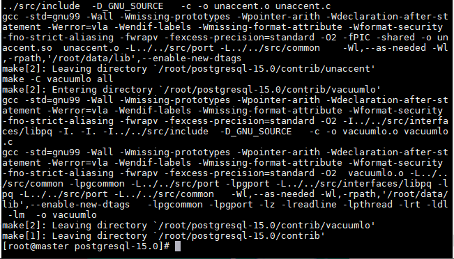
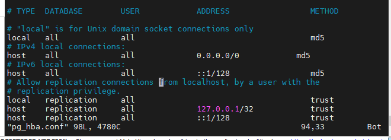
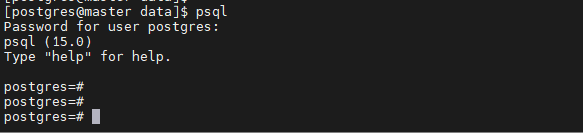
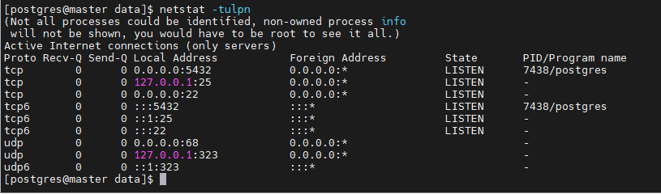

<h1 style="color:orange">Install postgresql từ source</h1>
<h2 style="color:orange">1. Prerequisites</h2>
Cài các package cần thiết 

    # yum install gcc zlib-devel readline-devel
Cài package postgre từ nguồn

    # wget https://ftp.postgresql.org/pub/source/v15.0/postgresql-15.0.tar.gz --no-check-certificate
    # tar xzvf postgresql-15.0.tar.gz
<h2 style="color:orange">2. Cài đặt postgresql</h2>
Tạo thư mục để install các file postgre config

    # mkdir /root/postgres
Ở đây cài vào thư mục /root/
Cài postgre

    # cd /root/postgresql-15.0
    # ./configure --prefix=/root/postgres
Output: 
 

Sau khi chạy lệnh configure, bắt đầu build postgreSQL với tất cả các contribution

    # make world-bin
đợi 10 phút... 

 
Sau khi build xong -> thì install

    # make install-world-bin
Sau khi chạy xong lệnh, nội dung file /root/postgres sẽ như sau: 
 
Tạo postgres user và thư mục để dùng 

    # useradd postgres
    # passwd postgres
    # mkdir /root/data
    # chown -R postgres:postgres /root/data /root/postgresql-15.0 /root/postgres
Cài biến môi trường cho postgres

    # vim /etc/profile.d/postgresql.sh
paste vào

    export PATH=$PATH:/root/postgres/bin
    
    # bash
Chạy initialize database trước khi sử dụng bất cứ câu lệnh postgres nào:

    # su postgres
    # initdb -D /root/data -U postgres -W
Với trường `-D` là location cho database cluster - thư mục data, `-U` là superuser và `-W` là password bắt buộc cho superuser.

<h2 style="color:orange">2.1. Config cho postgresql</h2>

1. Sau khi khởi động init database, thay đổi config 
    
       # vim /root/data/postgresql.conf
thay đổi dòng:

    #listen_addresses = 'localhost' thành 
    listen_addresses = '*'
thay đổi này có ý nghĩa rằng postgresql sẽ listen trên tất cả các địa chỉ mà host có, ta có thể thay đổi giá trị port mặc định 5432 trong file này

2. Cấu hình mở firewall cho port 5432.
3. Thay đổi config security cho postgresql

       # vim /root/data/pg_hba.conf
thay đổi các dòng sau thành: 
 

    host all  all  0.0.0.0/0 md5
để cài postgresql có thể đăng nhập từ tất cả đại chỉ với password

4. Chạy postgresql

       # pg_ctl -D /root/data/ -l /root/start.log start
với /root/start.log là file log khởi động của postgresql

<h2 style="color:orange">2.2. Kiểm tra</h2>
Thử đăng nhập postgresql

    # psql
 
Yêu cầu password đăng nhập. Để thoát phiên, chạy lệnh \q

Để đổi pass user trong postgresql

    # psql -d template1 -c "ALTER USER postgres WITH PASSWORD '123';"
Kiểm tra port listen 5432

    # netstat -tulpn
 
<h2 style="color:orange">3. Tạo file systemd để postgresql chạy daemon</h2>
Stop postgresql

    # pg_ctl stop -D /root/data -s -m fast
Tạo file system cho postgresql

    # su
    # vim /usr/lib/systemd/system/postgresql.service
paste vào

    [Unit]
    Description=PostgreSQL database server
    After=network.target
 
    [Service]
    Type=forking
    User=postgres
    Environment=PGPORT=5432
    Environment=PGDATA=/root/data/
    OOMScoreAdjust=-1000
    ExecStart=/root/postgres/bin/pg_ctl start -D ${PGDATA} -s -o "-p ${PGPORT}" -w -t 300
    ExecStop=/root/postgres/bin/pg_ctl stop -D ${PGDATA} -s -m fast
    ExecReload=/root/postgres/bin/pg_ctl reload -D ${PGDATA} -s
    TimeoutSec=300
    Restart=always
    RestartSec=30s
 
    [Install]
    WantedBy=multi-user.target

Phân quyền cho file 

    # chmod 644 /usr/lib/systemd/system/postgresql.service
    
    # systemctl enable postgresql
    # systemctl start postgresql
 