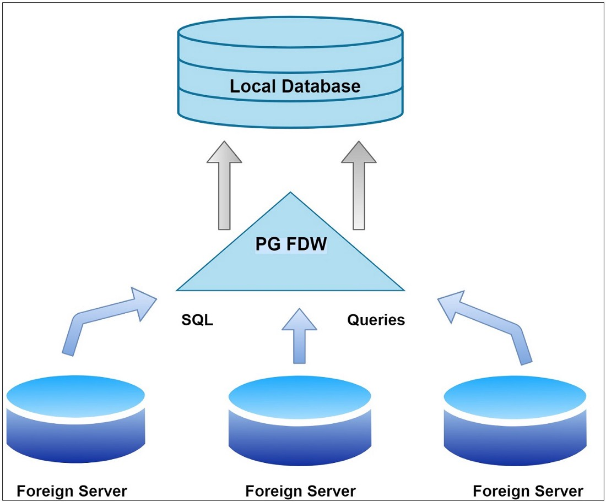
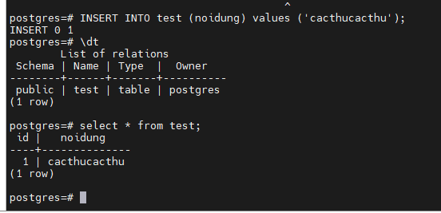

<h1 style="color:orange">Install foreign data wrapper cho postgresql</h1>
Foreign data wrapper cho phép ta sử dụng dữ liệu từ remote server như là dữ liệu local

 
postgres_fdw extension là postgres-to-postgres connector cho database ở cùng hoặc khác host.
<h2 style="color:orange">1. Prerequesites</h2>
Cài đặt postgresql trên 2 server: 
Local: 192.168.1.70 
Remote: 192.168.1.78 
Postgresql cài đặt phiên bản 15.0. Lưu ý: postgresql phiên bản trước 9.3 không support extension postgres_fdw này.
<h2 style="color:orange">2. Cài đặt</h2>
<h3 style="color:orange">2.1. Trên server remote</h3>
Tạo dữ liệu bảng trên remote server

    # psql
    postgres=# CREATE TABLE test (id SERIAL, noidung VARCHAR(50));
    postgres=# INSERT INTO test (noidung) values ('cacthucacthu');
List nội dung table

    postgres=# select * from test;
 

Mở firewall cho địa chỉ local 

    # firewall-cmd 

    