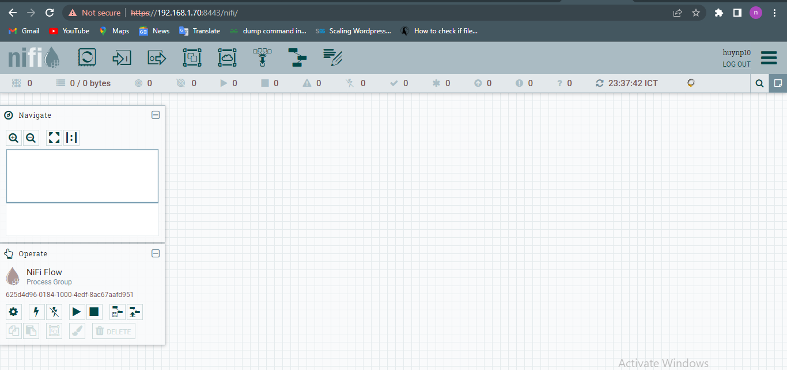

<h1 style="color:orange">Apache nifi install</h1>
<h2 style="color:orange">1. Prerequesites</h2>
Cài java

    # yum install -y java unzip
<h2 style="color:orange">2. Cài nifi</h2>

    # wget https://dlcdn.apache.org/nifi/1.18.0/nifi-1.18.0-bin.zip --no-check-certificate
    # unzip nifi-1.18.0-bin.zip
Tạo biến môi trường cho nifi

    # vim /etc/profile.d/apache.sh
paste vào

    export JAVA_HOME=/usr/lib/jvm/jre-1.8.0-openjdk
    export PATH=$PATH:$JAVA_HOME/bin
    export NIFI_HOME=/root/nifi-1.18.0
    export PATH=$PATH:$NIFI_HOME/bin
    # bash
Ở đây cài nifi vào /root/

Cấu hình nifi

    # vim $NIFI_HOME/conf/nifi.properties
    thay đổi 
    nifi.web.https.host=192.168.1.70
    nifi.web.https.port=8443
Mặc định chạy https trên port 8443, đổi địa chỉ https.host thành địa chỉ của máy cài nifi.

Mở firewall port 8443 cho nifi
<h2 style="color:orange">3. Chạy nifi</h2>
Lúc này nếu chạy đơn node nifi thì đã có thể start được luôn

    # nifi.sh start
Kiểm tra xem có start thành công không bằng cách xem file log

    # tail -f $NIFI_HOME/logs/nifi-bootstrap.log
Đổi pass cho nifi

    # nifi.sh set-single-user-credentials <username> <password>
Username, password được lưu mã hóa trong file conf/login-identity-providers.xml

Sau đó restart nifi

    # nifi.sh stop
    # nifi.sh start
Đăng nhập vào đường dẫn https://192.168.1.70:8443/nifi . Nhập user, password vừa đổi. 

 
Thành công