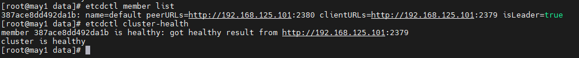
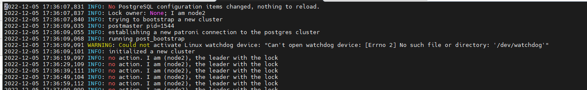
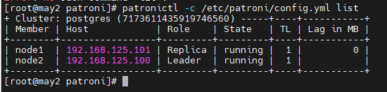
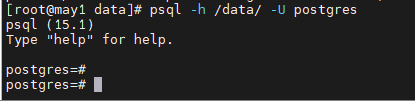
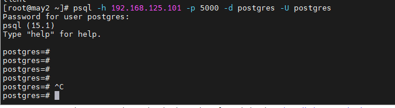

<h1 style="color:orange">Patroni postgresql install</h1>
Patroni là 1 phần mềm open-source để triển khai giải pháp HA cho Postgresql, Patroni được viết và chạy bằng Python. Nó cũng có thể chạy Database replication, backup và restore.

Etcd là phần mềm open-source đóng vai trò chứa metadata cho cluster postgresql. Nó quản lý công tác bình bầu leader. Mỗi khi 1 node Postgresql thay đổi state trong cluster, Etcd update state và lưu trữ state dưới dạng key-value. Với thông tin này, ETCD bình bầu node master và giữ cho cluster chạy liên tục.

Với giải pháp HA có nhiều hơn 1 DB node trong cluster. Ta dùng HAProxy. Nó track theo những thay đổi trong cluster và kết nối tới 
<h2 style="color:orange">1. Prerequesites</h2>
Cài đặt cluster etcd, postgresql và patroni trên 3 node: 
192.168.125.101/24 
192.168.125.100/24 
192.168.125.102/24 

Trong bài lab đã vô hiệu hóa Selinux và disable firewalld. Tuy vậy, trong thực tế phải mở các port được liệt kê dưới hướng dẫn.
<h2 style="color:orange">2. Install postgresql-15</h2>
Cài đặt repo cho postgresql-15

    # sudo yum install https://download.postgresql.org/pub/repos/yum/reporpms/EL-7-x86_64/pgdg-redhat-repo-latest.noarch.rpm -y
Cài đặt postgresql-15

    # yum install postgresql15 postgresql15-server postgresql15-contrib -y
    # yum install centos-release-scl -y
    # yum install llvm-toolset-7 -y
    # yum install postgresql15-devel -y
llvm-toolset-7 là package cần thiết cho postgresql15-devel
<h2 style="color:orange">3. Install Patroni</h2>
Trong bước này sẽ cài Patroni với Pip3. Trong khi cài đặt, Patroni sẽ sử dụng các hàm của Postgresql, được đặt mặc định ở `/usr/pgsql-15/bin/`. Do đó cần tạo symbolic links ở PATH trên để đảm bảo Patroni có thể tìm thấy và sử dụng các hàm này.

    # sudo ln -s /usr/pgsql-15/bin/* /usr/sbin/
Tạo 1 file môi trường:

    # vim /etc/profile.d/patroni.sh
    paste vào
    export PATH=$PATH:/usr/pgsql-15/bin
    # bash
Cài các package cần thiết

    # yum groupinstall "Development Tools" -y
    # yum install python3-devel -y
    # sudo pip3 install patroni psycopg2-binary python-etcd
<h2 style="color:orange">4. Install etcd</h2>

    # yum install etcd -y
Cấu hình mẫu trên 1 node etcd

    # vim /etc/etcd/etcd.conf
    thay đổi các dòng sau:
    ETCD_LISTEN_PEER_URLS="http://192.168.125.101:2380,http://localhost:2380"
    ETCD_LISTEN_CLIENT_URLS="http://192.168.125.101:2379,http://localhost:2379"
    ETCD_NAME="node1"
    ETCD_INITIAL_ADVERTISE_PEER_URLS="http://192.168.125.101:2380"
    ETCD_ADVERTISE_CLIENT_URLS="http://192.168.125.101:2379"
    ETCD_INITIAL_CLUSTER="node1=http://192.168.125.101:2380,node2=http://192.168.125.100:2380,node3=http://192.168.125.102:2380"
    ETCD_INITIAL_CLUSTER_TOKEN="etcd-cluster"
Start node etcd trên cả 3 node:

    # systemctl start etcd
    # systemctl enable etcd
Lệnh kiểm tra cluster etcd, trên 1 node:

    # etcdctl member list
    # etcdctl cluster-health
Vì là ví dụ nên chỉ cài trên 1 node:
 
<h2 style="color:orange">5. Cấu hình Patroni</h2>
Tạo directory patroni trong thư mục /etc/

    # mkdir /etc/patroni
    # cd /etc/patroni/
Copy nội dung file github mẫu của nhà phát triển: 

    # sudo curl -o config.yml https://raw.githubusercontent.com/zalando/patroni/master/postgres0.yml
Sau đó sửa các dòng

    # vim config.yml
    scope: postgres
    namespace: /db/
    name: node1

    restapi:
      listen: 192.168.125.101:8008
      connect_address: 192.168.125.101:8008

    etcd:
      hosts: 192.168.125.101:2379, 192.168.125.100:2379, 192.168.125.102:2379

    bootstrap:
      dcs:
        ttl: 30
        loop_wait: 10
        retry_timeout: 10
        maximum_lag_on_failover: 1048576
      postgresql:
        use_pg_rewind: true
        parameters:

      initdb:  # Note: It needs to be a list (some options need values, others are switches)
      - encoding: UTF8
      - data-checksums

      pg_hba:  # Add following lines to pg_hba.conf after running 'initdb'
      - host replication replicator 127.0.0.1/32 md5
      - host replication replicator 192.168.125.101/0 md5
      - host replication replicator 192.168.125.100/0 md5
      - host replication replicator 192.168.125.102/0 md5
      - host all all 0.0.0.0/0 md5

    users:
      admin:
        password: admin%
        options:
          - createrole
          - createdb

    postgresql:
      listen: 192.168.125.101:5432
      connect_address: 192.168.125.101:5432
      data_dir: data/patroni
      bin_dir: /usr/pgsql-15/bin
      pgpass: /tmp/pgpass0
      authentication:
        replication:
          username: replicator
          password: huy123
        superuser:
          username: postgres
          password: huy123
        rewind:  # Has no effect on postgres 10 and lower
          username: rewind_user
          password: rewind_password

      parameters:
        unix_socket_directories: '..'  # parent directory of data_dir

    log:
      dir: /data/log

    tags:
      nofailover: false
      noloadbalance: false
      clonefrom: false
      nosync: false
Trong đó nếu trường:
- `etcd.host:` 192.168.125.101:2379 là cài 1 host etcd, `etcd.hosts` là 1 cluster etcd
- `postgresql.data_dir:` là trường chứa dữ liệu data của postgresql
- `postgresql.authentication.replication.password` của user replication và superuser đều phải có cả chữ và số
- `postgresql.parameters.unix_socker_directories:` để '..' là nơi định nghĩa socket .s.PGSQL.5432 hoạt động

Tạo thư mục data cho patroni

    # sudo mkdir -p /data/patroni
    # sudo mkdir -p /data/log
    # sudo chown postgres:postgres -R /data/patroni\
    # sudo chmod 700 -R /data/
Tạo file service chạy daemon cho patroni

    # vim /etc/systemd/system/patroni.service
    paste vào
    [Unit]
    Description=High availability PostgreSQL Cluster
    After=syslog.target network.target

    [Service]
    Type=simple
    User=postgres
    Group=postgres
    ExecStart=/usr/local/bin/patroni /etc/patroni/config.yml
    KillMode=process
    TimeoutSec=30
    Restart=no

    [Install]
    WantedBy=multi-user.target
Chạy service patroni

    # sudo systemctl enable patroni
    # sudo systemctl start patroni
Log patroni đẩy ra: 
 
<h3 style="color:orange">5.1. Kiểm tra Patroni</h3>
Chạy lệnh 

    # patronictl -c /etc/patroni/config.yml list
 
Vào postgresql:

    # psql -h /data/ -U postgres
 
<h2 style="color:orange">6. Cài HA proxy</h2>

    # yum install -y haproxy
Thay đổi file config haproxy

    # vim /etc/haproxy/haproxy.cfg
    paste vào
    global
      maxconn 100

    defaults
      log global
      mode tcp
      retries 2
      timeout client 30m
      timeout connect 4s
      timeout server 30m
      timeout check 5s

    listen stats
      mode http
      bind *:7000
      stats enable
      stats uri /

    listen primary
      bind *:5000
      option httpchk /primary 
      http-check expect status 200
      default-server inter 3s fall 3 rise 2 on-marked-down shutdown-sessions
      server node1 node1:5432 maxconn 100 check port 8008
      server node2 node2:5432 maxconn 100 check port 8008
      server node3 node3:5432 maxconn 100 check port 8008

    listen standbys
      balance roundrobin
      bind *:5001
      option httpchk /replica 
      http-check expect status 200
      default-server inter 3s fall 3 rise 2 on-marked-down shutdown-sessions
      server node1 node1:5432 maxconn 100 check port 8008
      server node2 node2:5432 maxconn 100 check port 8008
      server node3 node3:5432 maxconn 100 check port 8008
Start service

    # systemctl start haproxy
    # systemctl enable haproxy
Kiểm tra haproxy: từ node khác chạy lệnh

    # psql -h 192.168.125.101 -p 5000 -d postgres -U postgres
với 192.168.125.101 là ip cài haproxy chạy trên port 5000.
 
-> thành công