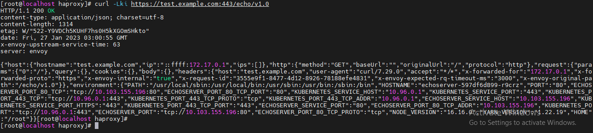

<h1 style="color:orange">Bài toán</h1>
Dựng mô hình microservice với API Gateway cơ bản trên K8S theo mô hình:

 
Mô tả các step:
- Dựng hệ thống k8s: có thể dùng minikube
- Cài đặt API Gateway lên hệ thống K8S vừa dựng. API gateway sử dụng Ambassador Edge
Stack
https://www.getambassador.io/products/edge-stack/api-gateway
- Cài đặt 1 backend service để test. Có thể sử dụng echo server
Echo server là 1 http server, nhận vào request và print ra request nhận được ở log
https://hub.docker.com/r/ealen/echo-server
- Cài đặt HAproxy trỏ đến API gateway để truy cập vào đến backend service từ bên ngoài
- Test hoạt động mô hình: thực hiện curl vào api: https://test.example.com/echo/v1.0
Xem log hoạt động của backend echo server

- Chuẩn bị: 1 server OS Centos7 có IP: 192.168.45.158/24 
OS đã vô hiệu hóa SELinux và firewalld cho môi trường lab
<h1 style="color:orange">1. Cài minikube</h1>
Minikube là opensource software cho việc dựng 1 node K8s. Phần mềm tạo 1 máy ảo và chạy K8s cluster trong máy ảo đó. 
Tham khảo link: https://phoenixnap.com/kb/install-minikube-on-centos

- B1: update system

      # sudo yum -y update
      # sudo yum -y install epel-release net-tools wget
- B2: Cài đặt minikube chạy trên nền ảo hóa KVM

      # sudo yum -y install libvirt qemu-kvm virt-install virt-top libguestfs-tools bridge-utils
      # sudo systemctl start libvirtd
      # sudo systemctl enable libvirtd 
- B3: Tạo user để sử dụng minikube
       
       # useradd minikube
       # passwd minikube
       # usermod -a -G libvirt minikube
       # usermod -a -G wheel minikubu
- B4: Cấu hình libvirtd:

       # sudo vim /etc/libvirt/libvirtd.conf
    thay đổi các dòng:

       unix_sock_group = "libvirt"
       unix_sock_rw_perms = "0770"
    
       # systemctl restart libvirtd
- B5: Cài minikube

       # wget https://storage.googleapis.com/minikube/releases/latest/minikube-linux-amd64
       # chmod +x minikube-linux-amd64
       # sudo mv minikube-linux-amd64 /usr/local/bin/minikube
 
- B6: cài kubectl: kubectl là CLI tool để làm việc với K8s

       # curl -LO https://storage.googleapis.com/kubernetes-release/release/`curl -s https://storage.googleapis.com/kubernetes-release/release/stable.txt`/bin/linux/amd64/kubectl
       # chmod +x kubectl
       # sudo mv kubectl  /usr/local/bin/
verify:

    # kubectl version --client -o json
 

Chạy cluster K8s: su sang user vừa tạo khác root: 

    # su minikube
    # minikube start
<h1 style="color:orange">2. Cài backend</h1>
Tham khảo link: https://ealenn.github.io/Echo-Server/pages/quick-start/kubernetes.html

    # curl -sL https://raw.githubusercontent.com/Ealenn/Echo-Server/master/docs/examples/echo.kube.yaml > echo.kube.yaml
comment các dòng:

    #apiVersion: v1
    #kind: Namespace
    #metadata:
    #  name: echoserver
    #  namespace: echoserver
Lưu ý: dòng "namespace: echoserver" xuất hiện nhiều lần. 

chạy file:

    # kubectl apply -f ./echo.kube.yaml
    # kubectl get svc
để kiểm tra service đã chạy 
 
<h1 style="color:orange">3. Cài API gateway</h1>
API gateway sử dụng ambassador tham khảo link: https://www.getambassador.io/docs/edge-stack/latest/tutorials/getting-started

    # kubectl apply -f https://app.getambassador.io/yaml/edge-stack/3.4.0/aes-crds.yaml && kubectl wait --timeout=90s --for=condition=available deployment emissary-apiext -n emissary-system
    # kubectl apply -f https://app.getambassador.io/yaml/edge-stack/3.4.0/aes.yaml && kubectl -n ambassador wait --for condition=available --timeout=90s deploy -lproduct=aes 
<h2 style="color:orange">3.1. Routing traffic từ edge</h2>
Ambassador Edge Stack sử dụng K8s Custom resource definition (CRD) để định nghĩa trạng thái mong muốn. Trong hướng dẫn sử dụng Listener CRD để cho ambassador biết listen trên port nào, mapping CRD cho ambassador biết làm thể nào để route incoming request đến service.

Bắt đầu với listener:

    # vim listener.yaml
paste vào
    
    ---
    apiVersion: getambassador.io/v3alpha1
    kind: Listener
    metadata:
      name: edge-stack-listener-8080
      namespace: ambassador
    spec:
      port: 8080
      protocol: HTTP
      securityModel: XFP
      hostBinding:
        namespace:
          from: ALL
    ---
    apiVersion: getambassador.io/v3alpha1
    kind: Listener
    metadata:
      name: edge-stack-listener-8443
      namespace: ambassador
    spec:
      port: 8443
      protocol: HTTPS
      securityModel: XFP
      hostBinding:
        namespace:
        from: ALL
Apply file

    # kubectl apply ./listener.yaml

Tạo mapping:

    # vim mapping.yaml
paste vào

    ---
    apiVersion: getambassador.io/v3alpha1
    kind: Mapping
    metadata:
      name: echoserver
    spec:
      hostname: "*"
      prefix: /echo/v1.0
    service: echoserver
      docs:
        path: "/.ambassador-internal/openapi-docs"
Apply file

    # kubectl apply ./mapping.yaml
 
<h2 style="color:orange">3.2. Kiểm tra hoạt động API gateway</h2>

    # minikube service edge-stack --namespace=ambassador
 
192.168.39.140 là địa chỉ máy ảo minikube tạo ra, port 31877 và 31143 là port máy ảo để bên ngoài truy cập được vào api gateway ambassador. 
Tiến hành curl để kiểm tra: 

    # curl -Lki https://192.168.39.140:31143/echo/v1.0
 
-> Thành công

Tiến hành check log pod chạy backend cũng trả về request vừa chuyền vào 
 
<h1 style="color:orange">4. Cài HAproxy</h1>

    # yum install -y haproxy
Cấu hình file config haproxy

    # vim /etc/haproxy/haproxy.cfg
paste vào

    defaults
        mode tcp

    frontend db
        bind *:443
        default_backend databases

    backend databases
        option forwardfor
        server db1 192.168.39.140:31143
Lưu ý: haproxy phải chạy layer 4 và cài option X-Forward-for. Tham khảo: getambassador.io/docs/edge-stack/latest/topics/running/host-crd

Cấu hình file /etc/hosts

    # vim /etc/hosts
    thêm vào cuối file:
    192.168.45.158 test.example.com

    # systemctl restart haproxy
    # systemctl enable hapropxy
    # bash
<h1 style="color:orange">5. Kiểm tra</h1>

    # curl -Lki https://test.example.com:443/echo/v1.0
 
----> Thành công

test may moi